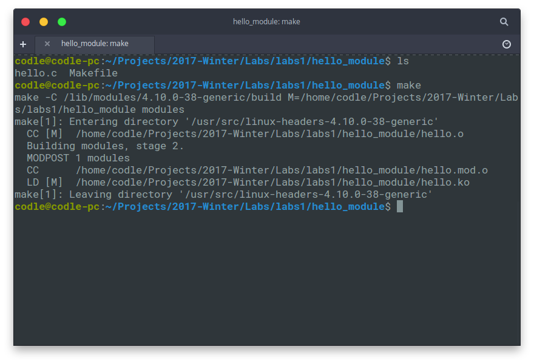
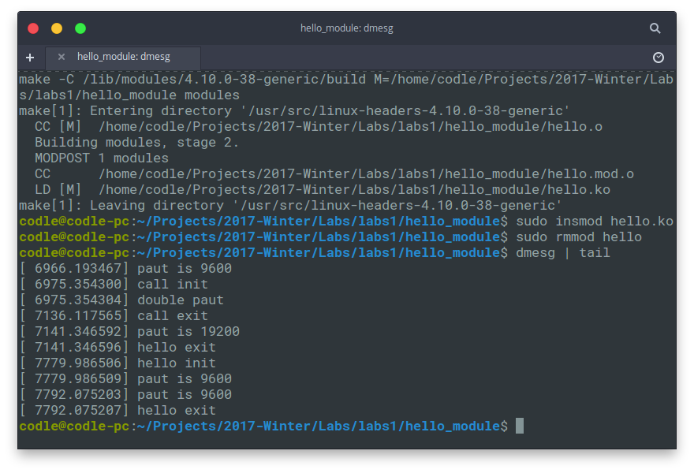
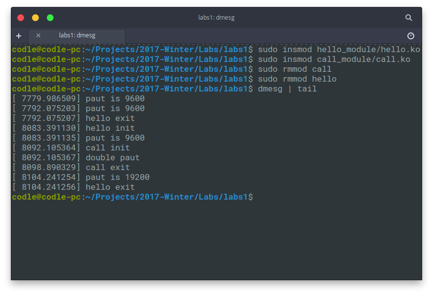

# 试验一 驱动程序环境熟悉


作者：Codle

时间：2017年11月30日


## 试验内容


1. 熟悉驱动程序在2.4或2.6环境下的编译过程；（下面环境为4.10）
2. 通过查看系统日志测试模块的安装及卸载；
3. 熟悉模块参数的使用；
4. 熟悉 *current。


## 试验步骤


### 1.	编写源程序

```c
#include <linux/init.h>
#include <linux/module.h>

MODULE_LICENSE("Daul GPL");

static int hello_init(void)
{
    printk(KERN_ALERT "hello init\n");
    printk(KERN_ALERT "paut is %d\n", paut);
    return 0;
}

static void hello_exit(void)
{
    printk(KERN_ALERT "paut is %d\n", paut);
    printk(KERN_ALERT "hello exit\n");
}

module_init(hello_init);
module_exit(hello_exit);
```


### 2.	编写Makefile文件

```makefile
obj-m :=hello.o
hellomodule-objs :=module
KERNELDIR := /lib/modules/$(shell uname -r)/build
PWD := $(shell pwd)
default:
		$(MAKE) -C $(KERNELDIR) M=$(PWD) modules
clean:
		rm -rf *.o .cmd *.ko *.mod.c .tmp_versions *.order *.symvers .*
```


### 3.	编译文件




### 4.	加载与卸载模块

安装模块

```bash
sudo insmod module_name.ko
```

卸载模块

```bash
sudo rmmod module_name
```

查看系统日志

```bash
dmesg | tail
```

截图




### 5.	内核模块的相互调用

修改原来的hello.c文件

```c
#include <linux/init.h>
#include <linux/module.h>

MODULE_LICENSE("Daul GPL");

static int paut = 9600;

static void double_paut(void)
{
    paut = paut*2;
}

static int hello_init(void)
{
    printk(KERN_ALERT "hello init\n");
    printk(KERN_ALERT "paut is %d\n", paut);
    return 0;
}

static void hello_exit(void)
{
    printk(KERN_ALERT "paut is %d\n", paut);
    printk(KERN_ALERT "hello exit\n");
}

EXPORT_SYMBOL(double_paut);
module_init(hello_init);
module_exit(hello_exit);
```


新建另一个call.c文件来创建新的模块

```c
#include <linux/init.h>
#include <linux/module.h>

MODULE_LICENSE("Daul GPL");

extern void double_paut(void);

static int call_init(void)
{
    printk(KERN_ALERT "call init\n");
    printk(KERN_ALERT "double paut\n");
    double_paut();
    return 0;
}

static void call_exit(void)
{
    printk(KERN_ALERT "call exit\n");
}

module_init(call_init);
module_exit(call_exit);
```


编译运行后

```bash
sudo insmod hello.ko
sudo insmod call.ko
sudo rmmod call.ko
sudo insmod hello.ko
dmesg | tail
```




