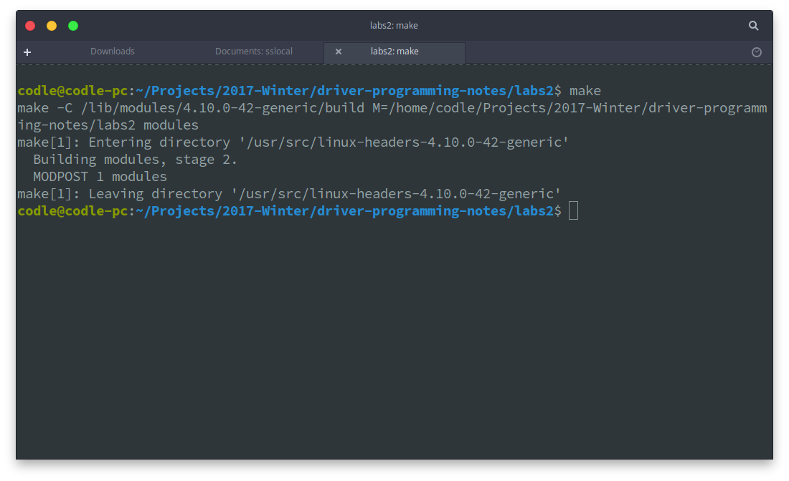
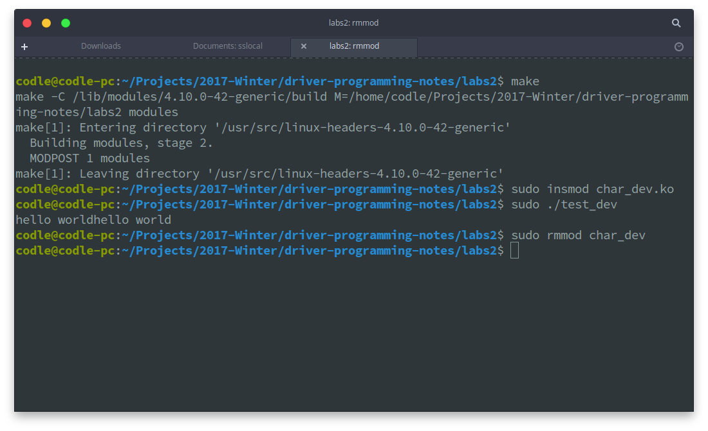

# 基于字符的驱动程序设计与开发

## 实验目的

1. 编写一个字符驱动程序，实现以下功能：
   + 有统一的读写缓冲区，所有的读写针对该缓冲区进行
   + 缓冲区默认的大小为1000BYTE，可以通过模块参数修改
   + 实现ioctl，包括设置缓冲区的大小，缓冲区中已有的数据个数（字节数），修改读写指针位置，清除缓冲区已有的内容（修改文件指针）
   + 实现对该设备的数据的READ,WRITE,LSEEK功能
   + 当设备缓冲区满或空的情况下，将读写进程置成阻塞（未实现）
   + 对临界资源则进行互斥访问（未实现）
2. 将驱动程序加载到系统内核中，并在/dev下建立相应的节点文件
3. 编写应用程序对驱动程序进行测试


## 实验内容

设备驱动头文件：

```c
// char_dev.h
#include <linux/module.h>   
#include <linux/fs.h>
#include <linux/cdev.h>
#include <linux/device.h>
#include <linux/init.h>
#include <linux/ioctl.h>
#include <linux/slab.h>
#include <linux/uaccess.h>

//=======================字符设备驱动模板开始 ===========================//   
#define CHAR_DEV_DEVICE_NAME   "char_dev"           // 是应当连接到这个编号范围的设备的名字，出现在/proc/devices和sysfs中   
#define CHAR_DEV_NODE_NAME    "char_dev"            // 节点名，出现在/dev中   
#define CHAR_DEV_CLASS_NAME   "char_dev_class"      //出现在/sys/devices/virtual/和/sys/class/中   

#ifndef CHAR_DEV_SIZE
#define CHAR_DEV_SIZE 4096
#endif

struct char_dev
{
    char *data;
    unsigned int size;
    struct cdev _cdev;
};

struct class *char_dev_class;       // class结构用于自动创建设备结点    
static int major = 0;               // 0表示动态分配主设备号，可以设置成未被系统分配的具体的数字。   
// static struct cdev char_dev_cdev;   // 定义一个cdev结构 
static struct char_dev * char_devp;
```

设备驱动程序：

```c
#include "char_dev.h"

// 进行初始化设置，打开设备，对应应用空间的open 系统调用    
int char_dev_open(struct inode *inode, struct file *filp)  
{  
    printk("open function.\n");
    //  这里可以进行一些初始化   
    struct char_dev * dev;

    printk("char_dev device open.\n");  

    dev = container_of(inode->i_cdev, struct char_dev, _cdev);
    
    /*将设备描述结构指针赋值给文件私有数据指针*/
    filp->private_data = dev;
    return 0;  
}  
   
// 释放设备，关闭设备，对应应用空间的close 系统调用   
static int char_dev_release (struct inode *node, struct file *file)  
{  
    //  这里可以进行一些资源的释放   
    printk("char_dev device release.\n");  
    return 0;  
}  

// 实现读功能，读设备，对应应用空间的read 系统调用   
/*__user. 这种注解是一种文档形式, 注意, 一个指针是一个不能被直接解引用的 
用户空间地址. 对于正常的编译, __user 没有效果, 但是它可被外部检查软件使 
用来找出对用户空间地址的错误使用.*/  
ssize_t char_dev_read(struct file *file, char __user *buff, size_t size, loff_t *offp)  
{  
    unsigned long p =  *offp;        /*记录文件指针偏移位置*/  
    unsigned int count = size;    /*记录需要读取的字节数*/ 
    int ret = 0;    /*返回值*/  
    struct char_dev *dev = file->private_data; /*获得设备结构体指针*/

    printk("char_dev device read. count=%d, p=%ld\n", count, p); 
    /*判断读位置是否有效*/
    if (p >= CHAR_DEV_SIZE)    /*要读取的偏移大于设备的内存空间*/  
        return 0;
    if (count > CHAR_DEV_SIZE - p)     /*要读取的字节大于设备的内存空间*/ 
        count = CHAR_DEV_SIZE - p;
    printk("copy\n");
    /*读数据到用户空间:内核空间->用户空间交换数据*/  
    // 需要重新写重定位 (void*)(dev->data) + p
    if (copy_to_user(buff, (void*)(dev->data + p), count))
    {
        printk("copy error, %d\n", count);
        ret = -EFAULT;
    }
    else
    {
        *offp += count;
        ret = count;
        
        printk(KERN_INFO "read %d bytes(s) from %ld\n", count, p);
    }

    return ret;
}  

// 实现写功能，写设备，对应应用空间的write 系统调用   
ssize_t char_dev_write(struct file *file,const char __user *buff, size_t size, loff_t *offp)  
{  
    unsigned long p =  *offp;
    unsigned int count = size;
    int ret = 0;
    struct char_dev *dev = file->private_data; /*获得设备结构体指针*/
    
    printk("char_dev device write.\n");  
    printk("size = %d, off=%ld\n", count, p);
    /*分析和获取有效的写长度*/
    if (p >= CHAR_DEV_SIZE)
        return 0;
    if (count > CHAR_DEV_SIZE - p)    /*要写入的字节大于设备的内存空间*/
        count = CHAR_DEV_SIZE - p;
    printk("%s\n", buff);
    printk("%s\n", dev->data);
    /*从用户空间写入数据*/
    if (copy_from_user(dev->data + p, buff, count))
        ret =  - EFAULT;
    else
    {
        *offp += count;      /*增加偏移位置*/  
        ret = count;      /*返回实际的写入字节数*/ 
        
        printk(KERN_INFO "written %d bytes(s) from %ld\n", count, p);
        printk("offp=%ld\n", (long)*offp);
    }

    return ret;
}  
   
// 实现主要控制功能，控制设备，对应应用空间的ioctl系统调用   
static long char_dev_ioctl(struct file *file, unsigned int cmd,unsigned long arg)  
{    
    printk("char_dev device ioctl.\n");  
    return 0;  
}  

static loff_t char_dev_lseek(struct file *file, loff_t offset, int whence)
{
    loff_t new_pos;
    printk("char dev seek, whence=%d\n", whence);
    printk("offset = %ld\n", (long)offset);
    switch(whence)
    {
        case 0:
            new_pos = offset;
            break;
        case 1:
            new_pos = file->f_pos + offset;
            break;
        case 2:
            new_pos = CHAR_DEV_SIZE - 1 + offset;
            break;
        default:
            return -EINVAL;
    }
    if((new_pos < 0) || (new_pos > CHAR_DEV_SIZE))
    {
        return -EINVAL;
    }

    file->f_pos = new_pos;
    return new_pos;
}
  
//  file_operations 结构体设置，该设备的所有对外接口在这里明确，此处只写出了几常用的   
static struct file_operations char_dev_fops =   
{  
    .owner = THIS_MODULE,  
    .open  = char_dev_open,      // 打开设备    
    .release = char_dev_release, // 关闭设备    
    .read  = char_dev_read,      // 实现设备读功能    
    .write = char_dev_write,     // 实现设备写功能    
    .llseek = char_dev_lseek
    // .unlocked_ioctl = char_dev_ioctl,     // 实现设备控制功能    
};  
  
// 设备建立子函数，被char_dev_init函数调用     
static void char_dev_setup_cdev(struct cdev *dev, int minor, struct file_operations *fops)  
{  
    int err, devno = MKDEV(major, minor);  
    cdev_init(dev, fops);//对cdev结构体进行初始化   
    dev->owner = THIS_MODULE;  
    dev->ops = fops;  
    err = cdev_add(dev, devno, 1);//参数1是应当关联到设备的设备号的数目. 常常是1   
    if(err)  
    {  
        printk(KERN_NOTICE "Error %d adding char_dev %d.\n", err, minor);  
    }  
     printk("char_dev device setup.\n");  
}  
  
//   设备初始化    
static int char_dev_init(void)  
{  
    int result, i;  
    dev_t dev = MKDEV(major, 0);//将主次编号转换为一个dev_t类型   
    if(major)  
    {  
        // 给定设备号注册   
        result = register_chrdev_region(dev, 1, CHAR_DEV_DEVICE_NAME);//1是你请求的连续设备编号的总数   
        printk("char_dev register_chrdev_region.\n");  
    }  
    else  
    {  
        // 动态分配设备号    
        result = alloc_chrdev_region(&dev, 0, 1, CHAR_DEV_DEVICE_NAME);//0是请求的第一个要用的次编号，它常常是 0   
        printk("char_dev alloc_chrdev_region.\n");  
        major = MAJOR(dev);  
    }  
    if(result < 0)//获取设备号失败返回   
    {  
        printk(KERN_WARNING "char_dev region fail.\n");  
        return result;  
    }  

    printk("The major of the char_dev device is %d.\n", major);  
    //==== 有中断的可以在此注册中断：request_irq，并要实现中断服务程序 ===//   
    // 创建设备节点   
    char_dev_class = class_create(THIS_MODULE,CHAR_DEV_CLASS_NAME);  
    if (IS_ERR(char_dev_class))  
    {  
        printk("Err: failed in creating char_dev class.\n");  
        return 0;  
    }  
    device_create(char_dev_class, NULL, dev, NULL, CHAR_DEV_NODE_NAME);  
    printk("char_dev device installed.\n");  

    char_devp = kmalloc(sizeof(struct char_dev), GFP_KERNEL);
    if (!char_devp) /*申请失败*/
    {
      result = -ENOMEM;
      goto fail_malloc;
    }
    memset(char_devp, 0, sizeof(struct char_dev));

    char_dev_setup_cdev(&char_devp->_cdev, 0, &char_dev_fops); 
    char_devp->_cdev.owner = THIS_MODULE;
    char_devp->_cdev.ops = &char_dev_fops;
    /*为设备分配内存*/
    printk("char_dev device malloc mem.\n"); 
    char_devp->size = CHAR_DEV_SIZE;
    char_devp->data = kmalloc(CHAR_DEV_SIZE, GFP_KERNEL);
    memset(char_devp->data, 0, CHAR_DEV_SIZE);
    printk("char_dev device finished init.\n"); 
    return 0;

    fail_malloc: 
    unregister_chrdev_region(dev, 1);
    return result;
}  
  
// 设备注销    
static void char_dev_cleanup(void)  
{  
    device_destroy(char_dev_class,MKDEV(major, 0));  
    class_destroy(char_dev_class);  
    cdev_del(&char_devp->_cdev);//字符设备的注销   
    unregister_chrdev_region(MKDEV(major, 0), 1);//设备号的注销   
    //========  有中断的可以在此注销中断：free_irq  ======//   
     printk("char_dev device uninstalled.\n");  
}  
  
module_init(char_dev_init);//模块初始化接口   
module_exit(char_dev_cleanup);//模块注销接口   
//所有模块代码都应该指定所使用的许可证，该句不能省略，否则模块加载会报错   
MODULE_LICENSE("Dual BSD/GPL");  
MODULE_AUTHOR("Author");  
MODULE_DESCRIPTION("Driver Description");  
```

测试程序：

```c
#include <stdio.h>
#include <stdlib.h>
#include <string.h>
int main()
{
    FILE* dev_file = fopen("/dev/char_dev", "r+");
    char test_str[50] = "hello world";
    char retr_str[50];
    int k;
    fwrite(test_str, strlen(test_str), 1, dev_file);
    fseek(dev_file, 0L, SEEK_SET);
    fread(retr_str, 100, 1, dev_file);
    printf("%s\n", retr_str);
    fclose(dev_file);
}
```

## 实验截图

`Make` 生成模块文件：



安装并测试：

