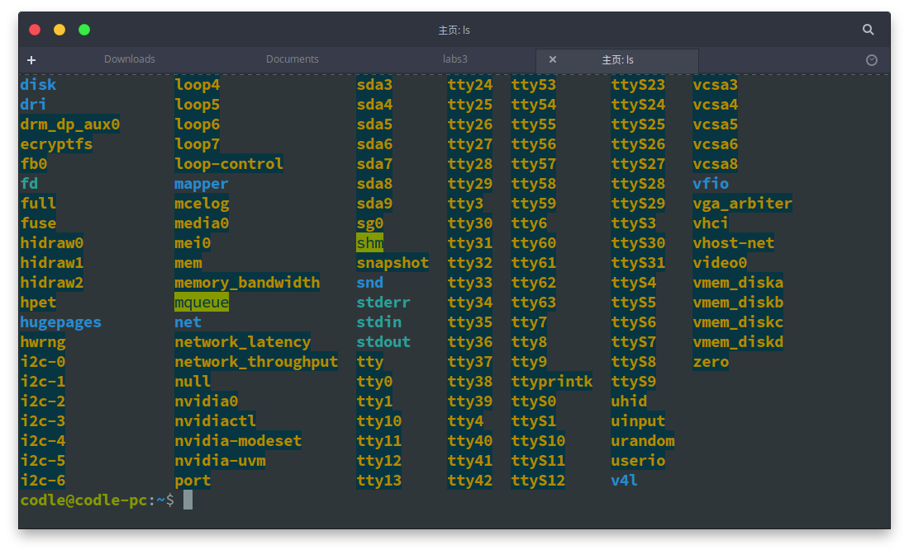

# 块设备的驱动程序设计

## 实验目的

+ 通过内存模拟一个块设备
+ 块设备的大小有参数制定
+ 编写应用程序测试驱动程序

## 实验内容

驱动程序代码：

```c
/*
 * Sample disk driver, from the beginning.
 */

#include <linux/module.h>
#include <linux/moduleparam.h>
#include <linux/init.h>
#include <linux/sched.h>
#include <linux/kernel.h>
#include <linux/slab.h>        
#include <linux/fs.h>
#include <linux/hdreg.h>
#include <linux/genhd.h>
#include <linux/blkdev.h>
#include <linux/bio.h>
#include <linux/vmalloc.h>

static int vmem_disk_major;
module_param(vmem_disk_major, int, 0);

#define HARDSECT_SIZE 512
#define NSECTORS 1024
#define NDEVICES 4

enum {
	VMEMD_QUEUE  = 0, /* Use request_queue */
	VMEMD_NOQUEUE = 1, /* Use make_request */
};
static int request_mode = VMEMD_QUEUE;
module_param(request_mode, int, 0);


#define VMEM_DISK_MINORS    16
#define KERNEL_SECTOR_SIZE  512

struct vmem_disk_dev {
	int size;                       /* Device size in sectors */
	u8 *data;                       /* The data array */
	spinlock_t lock;                /* For mutual exclusion */
	struct request_queue *queue;    /* The device request queue */
	struct gendisk *gd;             /* The gendisk structure */
};

static struct vmem_disk_dev *devices;

/*
 * Handle an I/O request.
 */
static void vmem_disk_transfer(struct vmem_disk_dev *dev, unsigned long sector,
		unsigned long nsect, char *buffer, int write)
{
	unsigned long offset = sector*KERNEL_SECTOR_SIZE;
	unsigned long nbytes = nsect*KERNEL_SECTOR_SIZE;

	if ((offset + nbytes) > dev->size) {
		printk (KERN_NOTICE "Beyond-end write (%ld %ld)\n", offset, nbytes);
		return;
	}
	if (write)
		memcpy(dev->data + offset, buffer, nbytes);
	else
		memcpy(buffer, dev->data + offset, nbytes);
}

/*
 * Transfer a single BIO.
 */
static int vmem_disk_xfer_bio(struct vmem_disk_dev *dev, struct bio *bio)
{
        struct bio_vec bvec;
        struct bvec_iter iter;
        sector_t sector = bio->bi_iter.bi_sector;

	bio_for_each_segment(bvec, bio, iter) {
		char *buffer = __bio_kmap_atomic(bio, iter);
		vmem_disk_transfer(dev, sector, bio_cur_bytes(bio) >> 9,
			buffer, bio_data_dir(bio) == WRITE);
		sector += bio_cur_bytes(bio) >> 9;
		__bio_kunmap_atomic(buffer);
	}
	return 0;
}

/*
 * The request_queue version.
 */
static void vmem_disk_request(struct request_queue *q)
{
	struct request *req;
	struct bio *bio;

	while ((req = blk_peek_request(q)) != NULL) {
		struct vmem_disk_dev *dev = req->rq_disk->private_data;
		if (req->cmd_type != REQ_TYPE_FS) {
			printk (KERN_NOTICE "Skip non-fs request\n");
			blk_start_request(req);
			__blk_end_request_all(req, -EIO);
			continue;
		}

		blk_start_request(req);
		__rq_for_each_bio(bio, req)
			vmem_disk_xfer_bio(dev, bio);
		__blk_end_request_all(req, 0);
	}
}


/*
 * The direct make request version.
 */
static unsigned int vmem_disk_make_request(struct request_queue *q, struct bio *bio)
{
	struct vmem_disk_dev *dev = q->queuedata;
	int status;

	status = vmem_disk_xfer_bio(dev, bio);
	bio_endio(bio);
	return status;
}

static int vmem_disk_getgeo(struct block_device *bdev, struct hd_geometry *geo)
{
	long size;
	struct vmem_disk_dev *dev = bdev->bd_disk->private_data;

	size = dev->size*(HARDSECT_SIZE/KERNEL_SECTOR_SIZE);
	geo->cylinders = (size & ~0x3f) >> 6;
	geo->heads = 4;
	geo->sectors = 16;
	geo->start = 4;

	return 0;
}

/*
 * The device operations structure.
 */
static struct block_device_operations vmem_disk_ops = {
	.getgeo          = vmem_disk_getgeo,
};

static void setup_device(struct vmem_disk_dev *dev, int which)
{
	memset (dev, 0, sizeof (struct vmem_disk_dev));
	dev->size = NSECTORS*HARDSECT_SIZE;
	dev->data = vmalloc(dev->size);
	if (dev->data == NULL) {
		printk (KERN_NOTICE "vmalloc failure.\n");
		return;
	}
	spin_lock_init(&dev->lock);

	/*
	 * The I/O queue, depending on whether we are using our own
	 * make_request function or not.
	 */
	switch (request_mode) {
	case VMEMD_NOQUEUE:
		dev->queue = blk_alloc_queue(GFP_KERNEL);
		if (dev->queue == NULL)
			goto out_vfree;
		blk_queue_make_request(dev->queue, vmem_disk_make_request);
		break;
	default:
		printk(KERN_NOTICE "Bad request mode %d, using simple\n", request_mode);
	case VMEMD_QUEUE:
		dev->queue = blk_init_queue(vmem_disk_request, &dev->lock);
		if (dev->queue == NULL)
			goto out_vfree;
		break;
	}
	blk_queue_logical_block_size(dev->queue, HARDSECT_SIZE);
	dev->queue->queuedata = dev;

	dev->gd = alloc_disk(VMEM_DISK_MINORS);
	if (!dev->gd) {
		printk (KERN_NOTICE "alloc_disk failure\n");
		goto out_vfree;
	}
	dev->gd->major = vmem_disk_major;
	dev->gd->first_minor = which*VMEM_DISK_MINORS;
	dev->gd->fops = &vmem_disk_ops;
	dev->gd->queue = dev->queue;
	dev->gd->private_data = dev;
	snprintf (dev->gd->disk_name, 32, "vmem_disk%c", which + 'a');
	set_capacity(dev->gd, NSECTORS*(HARDSECT_SIZE/KERNEL_SECTOR_SIZE));
	add_disk(dev->gd);
	return;

out_vfree:
	if (dev->data)
		vfree(dev->data);
}


static int __init vmem_disk_init(void)
{
	int i;

	vmem_disk_major = register_blkdev(vmem_disk_major, "vmem_disk");
	if (vmem_disk_major <= 0) {
		printk(KERN_WARNING "vmem_disk: unable to get major number\n");
		return -EBUSY;
	}

	devices = kmalloc(NDEVICES*sizeof (struct vmem_disk_dev), GFP_KERNEL);
	if (!devices)
		goto out_unregister;
	for (i = 0; i < NDEVICES; i++)
		setup_device(devices + i, i);

	return 0;

out_unregister:
	unregister_blkdev(vmem_disk_major, "sbd");
	return -ENOMEM;
}
module_init(vmem_disk_init);

static void vmem_disk_exit(void)
{
	int i;

	for (i = 0; i < NDEVICES; i++) {
		struct vmem_disk_dev *dev = devices + i;

		if (dev->gd) {
			del_gendisk(dev->gd);
			put_disk(dev->gd);
		}
		if (dev->queue) {
			if (request_mode == VMEMD_NOQUEUE)
				kobject_put (&dev->queue->kobj);
			else
				blk_cleanup_queue(dev->queue);
		}
		if (dev->data)
			vfree(dev->data);
	}
	unregister_blkdev(vmem_disk_major, "vmem_disk");
	kfree(devices);
}
module_exit(vmem_disk_exit);

MODULE_AUTHOR("Barry Song <baohua@kernel.org>");
MODULE_LICENSE("GPLv2");

```

安装完成后，检查 `/dev/` 目录：



发现多了一些 `vmem_disk` 设备。